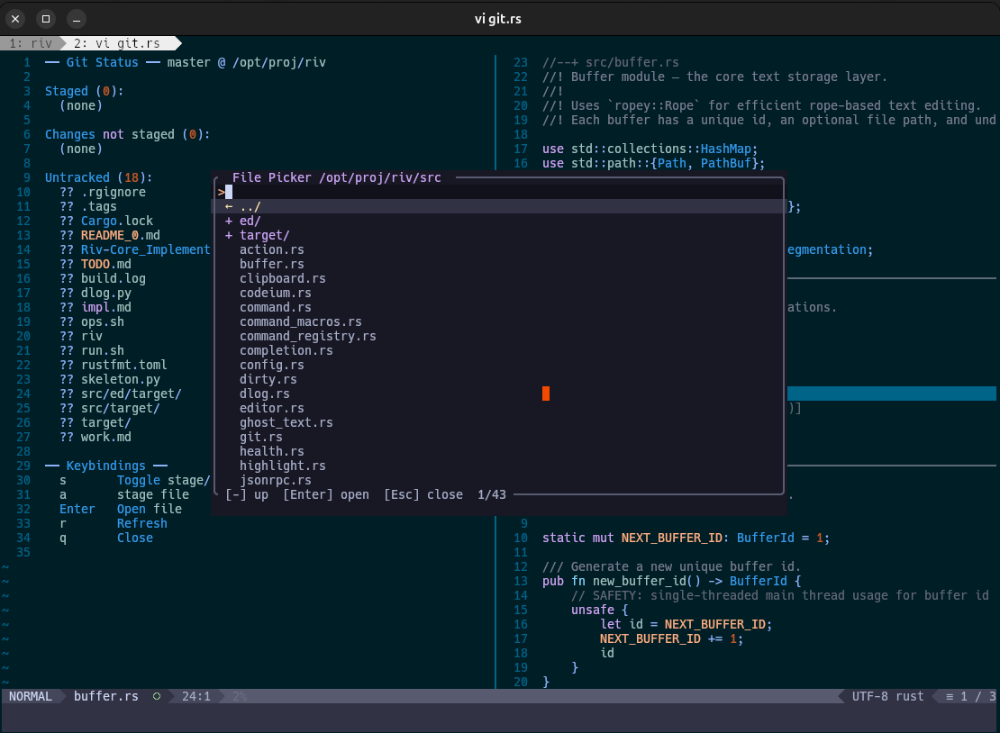
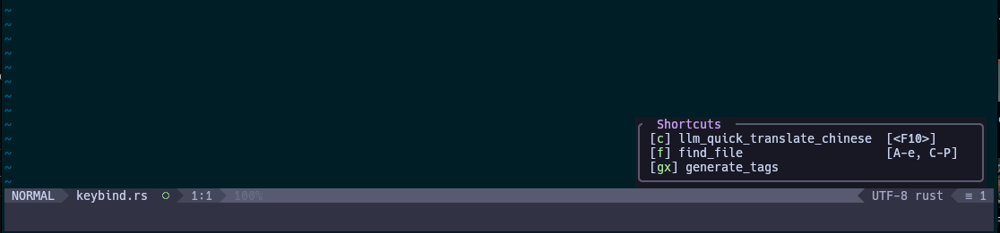

```markdown
# ⚠️ DEVELOPMENT ONLY – USE AT YOUR OWN RISK

> **WARNING:** This editor is in active development and may contain bugs that could corrupt or lose your data.  
> It is intended for development and testing purposes only.  
> **Do not use for production work or with irreplaceable files.**

## Overview

A terminal-based text editor written in Rust, designed with Vim-inspired modal editing at its core. 
The editor integrates modern development features including LSP support, AI code completion, 
Git integration, and LLM assistance while maintaining a lightweight terminal interface.

**8 editing modes:** Normal, Insert, Visual, Visual Line, Visual Block, Command, Operator-Pending, Replace

## Quick Start

```bash
cargo build --release
./target/release/riv [file]
```


## Architecture

| Component | Description |
|-----------|-------------|
| `editor.rs` | Central coordinator – manages buffers, windows, modes, event processing |
| `keybind.rs` | Key sequence → action mapping with per-mode keymaps and trie-based lookup |
| `action.rs` | Defines all editor actions with categorization for help displays |

## Key Features

This editor is optimized for my daily development workflow. Some operations differ from standard Vim:

### Modal Editing

| Mode | Description |
|------|-------------|
| **Normal** | Navigation and commands |
| **Insert** | Text input |
| **Replace** | Overwrite text |
| **Visual** | Character-wise selection |
| **Visual Line** | Line-wise selection |
| **Visual Block** | Column-wise selection |
| **Command** | `:` commands |
| **Operator-Pending** | Awaiting motion after operator |

**Count prefixes:** `5j` moves down 5 lines, `3dd` deletes 3 lines

### Movement

| Key | Action |
|-----|--------|
| `h` / `j` / `k` / `l` | Left / Down / Up / Right |
| `w` / `b` / `e` | Word forward / back / end |
| `0` / `^` / `$` | Line start / first non-blank / end |
| `gg` / `G` | File start / end |
| `%` | Match bracket |
| `Ctrl-u` / `Ctrl-d` | Scroll half-page |
| `zz` | Center cursor on screen |

### Editing

| Key | Action |
|-----|--------|
| `i` / `a` | Insert before / after cursor |
| `I` / `A` | Insert at line start / append at line end |
| `o` / `O` | Open line below / above |
| `x` / `X` | Delete character forward / backward |
| `dd` | Delete line |
| `yy` | Yank (copy) line |
| `p` / `P` | Paste after / before cursor |
| `u` / `Ctrl-r` | Undo / Redo |
| `.` | Repeat last change |
| `r` | Replace character |
| `J` | Join line below |
| `>` / `<` | Indent / Dedent |
| `==` | Smart indent (tree-sitter) |
| `=G` | Indent to end of file |
| `gcc` | Toggle comment on line |
| `gcj` | Toggle comment and move down |

### Visual Mode

| Key | Action |
|-----|--------|
| `v` / `V` / `Ctrl-v` | Visual / Visual Line / Visual Block |
| `d` / `y` / `c` | Delete / Yank / Change selection |
| `I` / `A` | Block insert / append |
| `o` | Swap anchor and cursor |

### Search & Navigation

| Key | Action |
|-----|--------|
| `/` / `?` | Search forward / backward |
| `n` / `N` | Next / previous result |
| `*` / `#` | Search word under cursor forward / backward |
| `m{a-z}` | Set named mark |
| `` `{a-z} `` | Goto named mark |
| ``` `` ``` | Jump back to previous position |

### Command Mode (`:`)

| Command | Description |
|---------|-------------|
| `:w` | Save file |
| `:wq` / `:x` | Save and quit |
| `:q` | Quit |
| `:q!` | Force quit |
| `:e <file>` | Open file |
| `:new` | New file |
| `:ls` | List buffers |
| `:bn` / `:bp` | Next / previous buffer |
| `:bd` | Delete buffer |
| `:sp` / `:vs` | Horizontal / vertical split |
| `:reg` | Show registers |
| `:help` | Show help |
| `:set nu` / `:set nonu` | Toggle line numbers |
| `:Git` | Git status |
| `:Rg <pattern>` | Ripgrep search |

### File & Buffer Management

| Action | Key / Command |
|--------|---------------|
| Save | `:w` or `Ctrl-s` |
| Save and format | `:x` |
| Open file | `:e` or `Ctrl-p` (picker) |
| New file | `:new` or `Ctrl-w n` |
| MRU | `:mru` |
| Buffer list | `:ls` |
| Next/prev buffer | `:bn` / `:bp` |
| Delete buffer | `:bd` |
| Close window | `Ctrl-w q` |

### Window Management

| Key | Action |
|-----|--------|
| `Ctrl-w s` | Horizontal split |
| `Ctrl-w v` | Vertical split |
| `Ctrl-w w` or `Tab` | Next window |
| `Ctrl-w q` | Close window |

### LSP Integration

| Key | Action |
|-----|--------|
| `gd` | Go to definition |

### AI & LLM Features

**Codeium** – AI code completion (`Alt-/`)

**LLM Quick Actions** (selection or current line):

| Action | Key |
|--------|-----|
| Grammar/English check | `'` in normal mode with selection |
| Translate to Chinese | `'` with selection → translate |
| Translate to English | `'` → translate to English |
| Explain code | `'` → explain |
| Summarize | `'` → summarize |

**LLM Session:**
- `gai` – Open LLM chat buffer
- Split layout for prompt/response
- `Ctrl-R` in prompt – Insert register, word, line, file path
- `Enter` – Send message

### Git Integration

| Key / Command | Action |
|---------------|--------|
| `]h` / `[h` | Next / previous git hunk |
| `ghr` | Revert hunk |
| `ghg` | Toggle git gutter |
| `:Git` | Git status buffer |
| `:Glog` | Git log explorer |
| `:GStatus` | Git log explorer |
| `:GCommit` | Git commit |

**In Git status buffer:**
- `s` – Stage file
- `a` – Add file
- `c` – Commit
- `Enter` – Open file
- `r` – Refresh
- `q` – Close

### Ripgrep Integration

| Key / Command | Action |
|---------------|--------|
| `grg` | Ripgrep word under cursor |
| `gri` | Ripgrep with input |
| `:Rg <pattern>` | Search with pattern |
| `Enter` (in results) | Goto result |
| `Ctrl-n` / `Ctrl-p` | Next / previous result |
| `q` | Close results |

### Tags (Ctags)

| Key | Action |
|-----|--------|
| `Ctrl-]` | Jump to tag under cursor |
| `Ctrl-t` | Pop tag stack |
| `:tags` | Generate tags file |

### Completion Systems

| Key | Action |
|-----|--------|
| `Tab` / `Shift-Tab` | Next / previous completion |
| `Enter` | Confirm completion |
| `Ctrl-e` | Cancel completion |
| `Alt-/` | Codeium AI completion |

### Undo/Redo

| Key | Action |
|-----|--------|
| `u` | Undo |
| `Ctrl-r` | Redo |
| `Ctrl-G u` | Undo break (start new undo sequence) |

### Popup Systems

| Popup | Trigger | Navigation |
|-------|---------|------------|
| Help | `:help` or `?` | `j/k`, `Enter`/`Esc` |
| Keymap | `:keymap` | `j/k`, `Enter`/`Esc` |
| Register | `:reg` | `Esc`/`q` to close |
| File picker | `Ctrl-p` | `j/k`, `Enter` to select, `-` to parent, `Esc` to close |
| Function list | `:func` | `j/k`, `Enter` to jump |
| Format info | Auto on format error | `Esc`/`q`/`Enter` to close |

## Technical Details

### Core Components

**Keybind Manager** (`keybind.rs`)
- Per-mode keymaps (normal, insert, visual, command)
- Multi-key sequence support (e.g., `gg`, `dd`, `gcc`)
- Which-key style hints for pending sequences
- TOML configuration with `<leader>` support
- `parse_key_str()` and `parse_action_str()` for config parsing

**Buffer Collection** (`buffer.rs`)
- Manages multiple buffers (normal, LLM, ripgrep, git status/diff/log, LLM input)
- Dirty state tracking
- Undo tree with branching and grouping
- Tree-sitter incremental parsing
- Unicode grapheme-cluster-aware cursor positioning

**Window Manager** (`window.rs`)
- Handles split windows (horizontal/vertical)
- Cursor position management per window
- Viewport scrolling
- Resize handling

**Command Registry** (`command_registry.rs`)
- Extensible command system for `:` commands
- Built-in commands for file ops, git, LLM, etc.
- Command history with prefix-filtering

### Implementation Patterns

- **Event-driven:** Terminal events → `Editor::process_event()` → `process_key()` → action dispatch
- **Trait extensions:** Functionality organized into extension traits (`MovementExt`, `EditingExt`, `GitExt`, `LspExt`, `VisualExt`, etc.)
- **Async task management:** LSP, Codeium, and LLM run on tokio runtime with message passing
- **Debounced operations:** LSP change notifications (20ms) and git gutter updates (500ms) use timers
- **Popup overlays:** Non-modal overlays with key interception
- **Session persistence:** Save/restore layout, buffers, marks, cursor positions

## Dependencies

| Crate | Purpose |
|-------|---------|
| `ropey` | Rope-based text storage for efficient editing |
| `tree-sitter` | Incremental parsing for syntax highlighting |
| `tokio` | Async runtime for LSP, git, LLM, file I/O |
| `crossterm` | Terminal raw mode, events, styling |
| `serde` / `toml` | Configuration serialization |
| `regex` | Search and substitute |
| `thiserror` | Error type definitions |
| `unicode-segmentation` | Grapheme cluster handling |

## Configuration

TOML-based configuration file (`~/.config/editor/config.toml`):

```toml
leader = " "

[keybindings.normal]
"<leader>ff" = "find_file"
"<leader>gg" = "git_status"

[keybindings.insert]
"<leader>q" = "force_quit"

```

- Custom keybindings with `<leader>` prefix
- Per-mode keymap customization
- Color scheme support
- Editor options (line numbers, tab width, etc.)

## Building from Source

```bash
# Clone the repository
git clone https://github.com/lecheel/riv
cd riv

# Build release version
cargo build --release

# Run
./target/release/riv [file]

# Run with debug logging
RUST_LOG=debug ./target/release/riv [file]
```

## ⚠️ Development Status
This editor is under active development for my daily workflow. Current known limitations:

- May contain bugs that could corrupt data
- LSP integration is partial (some features not implemented)
- Performance not yet optimized for very large files
- Some features are experimental
- API and configuration format may change

**Use with caution and always keep backups of your work.**

## License

[Your License Here]

## Contributing

Contributions welcome! Please test thoroughly before submitting PRs.
```
